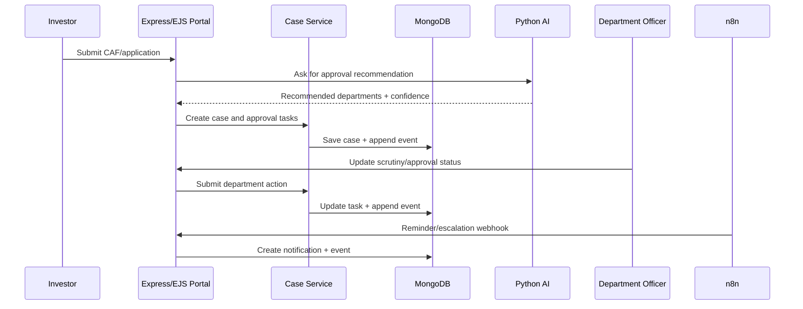

# UdyogSetu 360 Architecture Notes

## Monorepo integration snapshot

- `web/` remains the preserved legacy SSR portal while new workspace apps are introduced.
- `apps/` contains user-facing portal entry points plus the new gateway.
- `services/` contains backend capability services and the new FastAPI AI service.
- `packages/shared` holds reusable platform helpers, event constants, and logging.
- `packages/ui` is the landing zone for shared EJS layout extraction once the wrappers are stable.

## Boundary rules

- **Express + EJS**: human portals and server-rendered pages.
- **MongoDB + Mongoose**: operational state, current case views, users, tasks, grievances and notifications.
- **Append-only EventLog collection**: audit-friendly domain history.
- **Python FastAPI AI service**: advisory intelligence only; it never mutates case state.
- **n8n**: reminders, reconciliation, escalation and integration glue; it never owns case state.
- **Future Kafka/RabbitMQ layer**: Kafka for replayable canonical lifecycle events, RabbitMQ for department adapter delivery queues.

## Core data flow

## Pilot department families

1. Pollution control
2. Power utility
3. Fire and emergency services
4. Industrial safety and labour factories
5. Labour department
